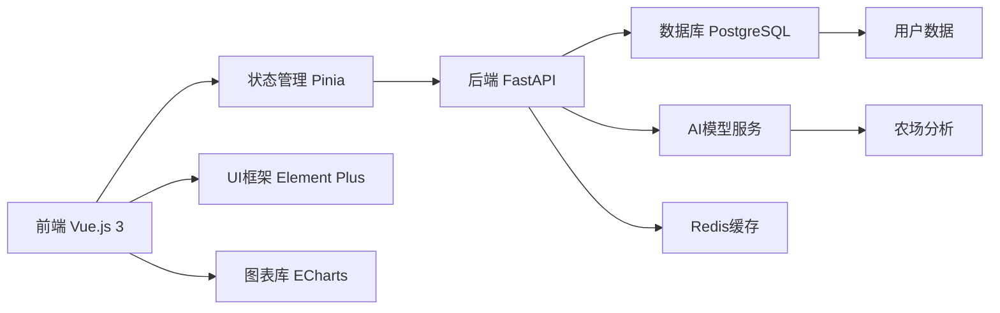
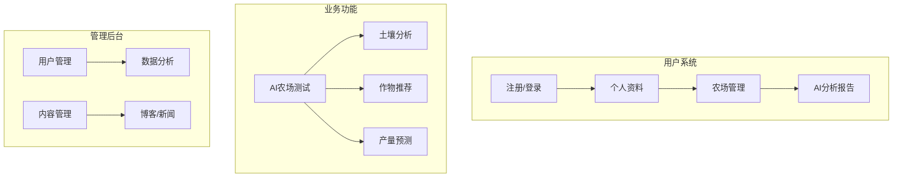

# AI智慧农业公司网站设计文档

## 项目概述
为AI智慧农业公司设计一个现代、美观且功能完善的企业网站，展示公司价值的同时提供用户交互功能。网站将包含公司介绍、业务展示和用户服务系统，采用Vue.js前端和FastAPI后端架构，确保可扩展性和维护性。

## 技术架构



## 网站结构与功能模块

### 核心页面结构
1. **公司介绍主页**
2. **业务解决方案**
3. **AI农场测试系统**
4. **用户中心**
5. **博客/知识库**
6. **联系我们**

### 功能模块设计



## 详细功能说明

### 1. 公司介绍主页
- **视觉设计**：采用农业科技感配色（绿色+科技蓝渐变），全屏视频背景展示农场无人机航拍
- **核心组件**：
  - 价值主张横幅（3D动画作物模型）
  - 公司使命与技术优势卡片
  - 动态数据展示（服务农场数、AI分析量等）
  - 客户案例轮播（交互式3D旋转展示）

### 2. 用户系统
- **注册登录**：
  - 多方式登录（邮箱+密码、手机验证码、第三方）
  - 渐进式分析（注册时收集基础农场信息）
- **个人中心**：
  - 农场信息管理（地理位置、面积、作物类型）
  - AI分析报告历史记录
  - 个性化推荐订阅

### 3. AI农场测试系统
- **数据输入**：
  - 农场地图标注工具（集成地图API）
  - 多源数据上传（土壤照片、卫星图像、CSV传感器数据）
- **分析流程**：
  ```mermaid
  sequenceDiagram
      用户->>+前端： 上传农场数据
      前端->>+后端： 提交分析请求
      后端->>+AI模型： 处理数据
      AI模型-->>-后端： 生成分析结果
      后端-->>-前端： 返回结构化报告
      前端->>用户： 可视化展示报告
  ```
- **报告展示**：
  - 交互式3D农场模型
  - 土壤健康评分（径向进度条）
  - 作物生长预测时间线
  - 优化建议卡片（带执行优先级）

### 4. 管理后台
- **仪表盘**：用户增长、功能使用热力图
- **内容管理**：Markdown编辑器+自动SEO优化
- **AI模型监控**：实时性能指标展示

## UI/UX设计规范

### 视觉风格
- **色彩系统**：
  - 主色：`#2e7d32`（深绿）、`#0066cc`（科技蓝）
  - 辅色：`#ffc107`（丰收金）、`#4caf50`（活力绿）
  - 中性色：`#f5f9f4`（背景白）、`#263238`（文字深）
- **字体**：
  - 标题：`Montserrat`（现代感）
  - 正文：`Open Sans`（高可读性）
- **动效原则**：
  - 数据加载：粒子动画
  - 页面切换：平滑视差滚动
  - 交互反馈：微动效（按钮涟漪、卡片悬浮）

### 响应式设计
- **断点设置**：
  - 移动端：<768px（卡片垂直堆叠）
  - 平板：768-1024px（两栏布局）
  - 桌面：>1024px（多栏复杂布局）
- **移动端优化**：
  - 农场地图标注简化
  - 数据输入分步向导
  - 报告摘要视图

## 开发路线图

阶段 | 功能 | 时间
--- | --- | ---
1 | 核心页面+用户系统 | 2周
2 | AI测试基础功能+报告展示 | 3周
3 | 管理后台+内容系统 | 2周
4 | 高级分析功能+移动优化 | 3周
5 | 性能优化+测试部署 | 1周

## 后续扩展功能
1. **农场物联网集成**：实时传感器数据接入
2. **AI农技顾问**：聊天机器人+AR指导
3. **供应链对接**：农产品溯源系统
4. **气候预测模型**：区域天气影响分析
5. **农场社交功能**：种植者社区+知识共享

## 性能与安全
- **前端优化**：
  - 组件懒加载
  - 图片智能压缩（WebP格式）
  - API请求节流
- **后端安全**：
  - JWT认证+RBAC权限控制
  - 敏感数据加密（AES-256）
  - 请求速率限制
- **部署**：
  - Docker容器化
  - Nginx反向代理
  - 自动SSL证书更新

这个设计文档提供了全面的网站架构和功能规划，平衡了视觉吸引力和技术可行性。Vue.js+FastAPI的组合确保了开发效率和性能，模块化设计便于后续功能扩展。