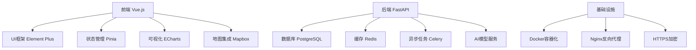
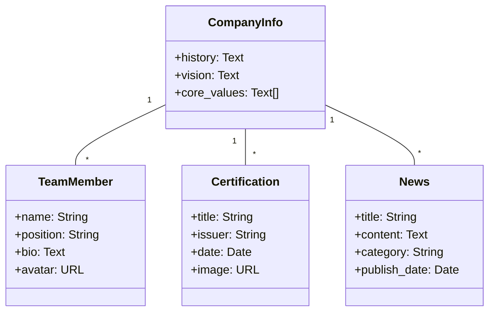
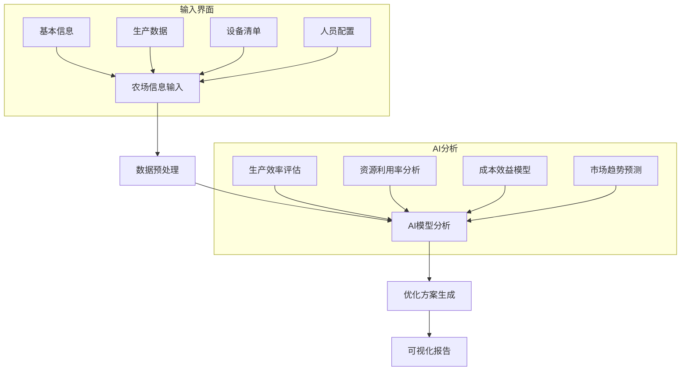
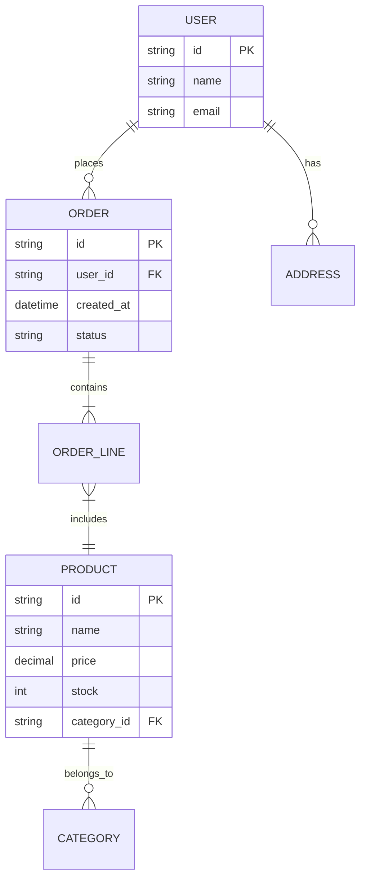
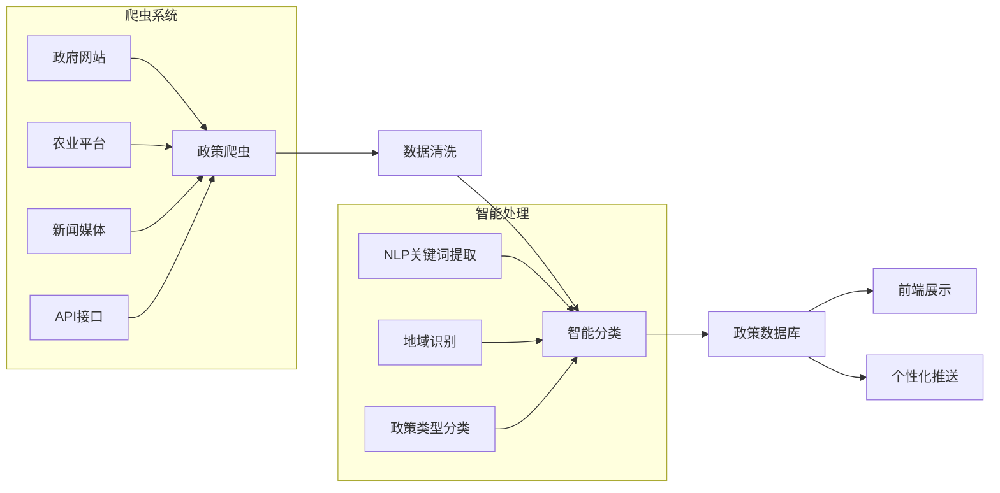
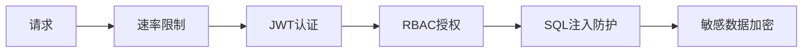

# 南京黍苗科技有限公司网站设计方案

## 一、技术架构



## 二、通用功能实现方案

### (一) 用户系统设计

```mermaid
sequenceDiagram
    用户->>前端： 选择注册方式（手机/邮箱/第三方）
    前端->>后端： 发送验证请求
    后端->>短信/邮件服务： 发送验证码
    用户->>前端： 输入验证码
    前端->>后端： 提交注册信息
    后端->>数据库： 存储用户数据
    后端-->>前端： 返回注册成功
```

#### 关键实现细节：
1. **多方式登录组件**
   - 封装统一Auth组件处理所有登录方式
   - 第三方登录使用OAuth2.0协议
2. **安全增强**
   - 密码使用bcrypt加密
   - 敏感操作需二次验证
   - 登录记录IP和设备信息

### (二) 公司信息展示系统

#### 模块结构：


#### 特色功能：
- **交互式时间轴**展示公司发展历程
- **3D团队展示墙**（使用Three.js）
- **荣誉证书画廊**（点击放大查看）
- **智能新闻推荐**（基于用户兴趣）

## 三、定制功能实现方案

### (一) 家庭农场优化系统



#### 关键组件：
1. **农场信息收集表单**
   - 分步骤向导式设计
   - 地理信息地图标注
   - 设备拍照识别功能
2. **AI分析报告**
   - 交互式3D农场模型
   - 资源热力图可视化
   - 时间轴预测展示
   - PDF导出功能（含公司水印）

### (二) 农产品电商平台



#### 特色功能：
- **VR农场体验**：360度查看产品原产地
- **智能推荐系统**：基于用户偏好推荐农产品
- **溯源系统**：区块链记录农产品全流程
- **直播带货**：集成直播模块

### (三) 农业政策服务系统



#### 核心功能：
1. **政策雷达**
   - 实时监控政策更新
   - 更新频率智能调整（重要政策即时抓取）
2. **政策解读引擎**
   - AI生成政策摘要
   - 专家解读视频嵌入
   - 申请指南流程图
3. **个性化推送**
   - 基于用户农场类型匹配
   - 地域精准推送
   - 政策到期提醒

## 四、UI/UX设计规范

### 视觉系统 
| 类别 | 规范 |
|------|------|
| 主色调 | `#2e8b57`(森林绿), `#1e6b52`(深绿), `#f5f9f4`(背景白) |
| 辅助色 | `#ffd700`(丰收金), `#4169e1`(科技蓝) |
| 字体 | 标题: `Alibaba PuHuiTi` (现代感), 正文: `Noto Sans SC` (高可读性) |
| 图标 | 线性图标库 + 定制农业图标 |
| 间距 | 8px基准系统 (4,8,16,24,32,48,64) |

### 交互动效
1. **数据加载**：粒子生长动画
2. **页面切换**：平滑视差滚动
3. **表单交互**：微动效反馈
4. **3D元素**：农场模型交互旋转

### 响应式设计


- **移动优先**：核心功能单手操作优化
- **Pad适配**：双栏信息布局
- **桌面增强**：多窗口协同操作

## 五、开发路线图

阶段 | 里程碑 | 时间 
---|---|---
1 | 核心框架+用户系统 | 2周
2 | 公司信息模块+农场分析基础 | 3周
3 | 电商平台+政策爬虫 | 4周
4 | AI集成+3D可视化 | 3周
5 | 测试优化+部署 | 2周

## 六、性能与安全

### 前端优化
- 组件懒加载
- 虚拟滚动长列表
- WebP图片格式
- API请求节流

### 后端安全


### 部署方案
- Docker Swarm集群
- 自动伸缩策略
- 日志监控系统
- 每日自动备份

## 七、扩展能力设计

1. **物联网接口**：预留传感器数据接入点
2. **区块链扩展**：农产品溯源增强
3. **AR模块**：农田AR指导预留
4. **多语言支持**：i18n国际化集成
5. **API开放平台**：第三方接入能力

本方案结合现代农业科技与前沿Web技术，通过模块化设计确保系统可扩展性，采用AI+3D可视化提升用户体验，为南京黍苗科技打造行业领先的智慧农业平台。